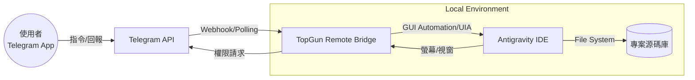

# 系統分析文件 (System Analysis)

## 1. 系統描述
本系統「Antigravity Remote Bridge」旨在建立一個遠端閘道，允許開發者透過 Telegram 介面跨越地理限制，安全且直覺地操作內網中的 Antigravity AI IDE。系統透過分層架構確保了指令傳遞的穩定性與 GUI 自動化的精準度。

## 2. 系統邊界 (Context Diagram)

### 角色說明
- **使用者**: 透過 Telegram 送出指令（如系統分析、程式碼修改）並接收自動化執行結果與權限請求。
- **Telegram API**: 負責即時通訊的訊息媒介。
- **TopGun Remote Bridge**: 核心主機，負責解析使用者意圖、調度任務策略並驅動後端 GUI 模擬。
- **Antigravity IDE**: 目標受控端，執行實際的 AI 程式碼開發與分析任務。

## 3. 核心需求分析
- **遠端驅動**: 支援 `Ctrl+L` 開啟 Agent 面板並精準注入 Prompt。
- **狀態監控**: 即時回傳任務進度與 IDE 視窗狀態。
- **人機協同 (Permission Relay)**: 當 IDE 需要高權限操作（如刪減檔案）時，攔截權限對話框並轉發至 Telegram 由人工確認。
- **分層擴充**: 任務逻辑應與 GUI 驅動邏輯分離，以便支援不同的開發框架與任務範本。
