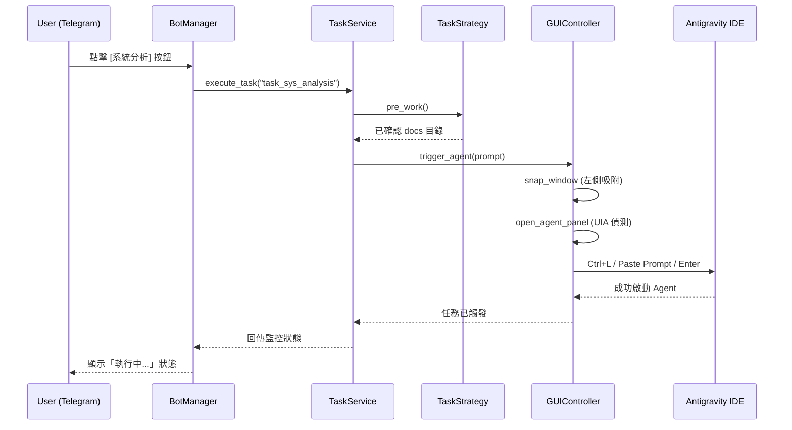
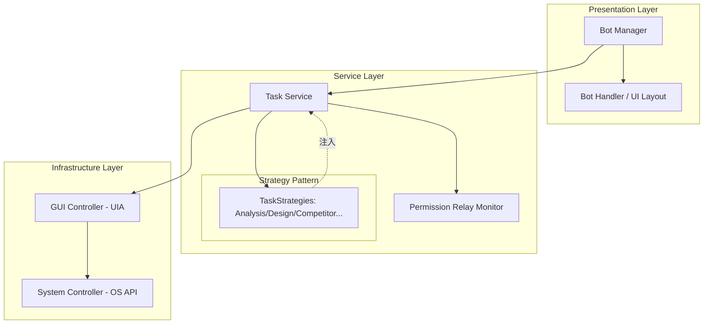

# 系統設計文件 (System Design)

## 1. 不可撼動原則 (Immutable Principles)
- **單一職責 (SRP)**: 展示層 (Presentation) 僅處理 Telegram 訊息解析，不參與座標計算；基礎層 (Infrastructure) 僅負責精準定位與驅動，不理解業務邏輯。
- **策略先行 (Strategy First)**: 任何新功能 (如專案總結、單元測試生成) 必須透過實作 `TaskStrategy` 加入，不允許在 `TaskService` 中撰寫 Ad-hoc 邏輯。
- **精準定位 (Precise Targeting)**: 捨棄不穩定的絕對座標點擊，全面使用 UIA (UI Automation) 尋找 UI 元素（如 `Edit` 型態的輸入框）。
- **非同步阻斷 (Async Non-blocking)**: 所有 GUI 操作與監控必須在獨立的 `asyncio` task 中執行，確保 Telegram Bot 不會因為單次卡死而失去回應。

## 2. 目錄結構 (Directory Tree View)

```texts
antigravity-remote-bridge/
├── bridge_state.json      # 使用者狀態持久化
├── config.json            # 敏感資訊 (TOKEN, ID)
├── main.py                # 系統總入口
├── core/
│   ├── presentation/      # 展示層
│   │   ├── bot_handler.py # UI 佈局與視覺風格
│   │   └── bot_manager.py # Telegram 路由與狀態機
│   ├── services/          # 服務層 (業務邏輯)
│   │   ├── strategies/    # 任務策略實現庫
│   │   │   ├── base.py    # 抽象基底
│   │   │   ├── general.py # 通用文檔/程式碼任務
│   │   │   └── competitor.py # 具備防呆邏輯的競品分析
│   │   ├── permission_relay.py # 權限對話框監控器
│   │   └── task_service.py # 任務生命週期協調
│   ├── infrastructure/    # 基礎架構層
│   │   ├── gui_ctrl.py    # UIA/PyAutoGUI 精準驅動
│   │   ├── system_ctrl.py # OS 層級操作 (視窗吸附、輸入法切換)
│   │   └── agent_executor.py # 核心執行封裝
│   ├── tasks.py           # 靜態任務模板偵測
│   └── utils.py           # 共用工具類
└── docs/                  # 系統文檔區
```

## 3. 介面設計 (時序圖 - Sequence Diagram)



## 4. 系統架構 (Architecture Diagram)


